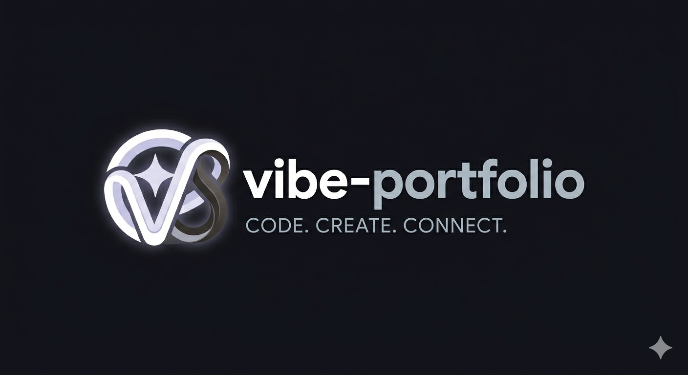

<br />
<div align="center">
  <a href="https://github.com/oshriagronov/vibe-portfolio">
    
  </a>
  <h3 align="center">Vibe Portfolio</h3>
  <p align="center">
    A vibe coded portfolio site Generated with Google Stitch & Polished with Google AI Studio.
  </p>
</div>

## About

This project showcases a vibe coded portfolio site. It was generated using Google Stitch and polished with Google AI Studio to create an interactive and visually pleasing experience.

## Technologies used

- js, html & css.
- React.
- TailwindCSS.

## Tools Utilized

- Google Stitch.
- Google AI Studio.

## Getting Started

### 💻 Local Setup

To get a local copy up and running, follow these simple steps.

#### Prerequisites

- nodejs
- npm
- vite

#### Initialization

---

1. **Clone and enter the repository:**

   ```bash
   git clone https://github.com/oshriagronov/vibe-portfolio && cd vibe-portfolio
   ```

2. **Install npm modules:**

   ```bash
   npm i
   ```

3. **Run in dev mode:**  
   ```bash
   npm run dev
   ```

4. **Go to the site:**
<br/> [http://localhost:3000](http://localhost:3000)
